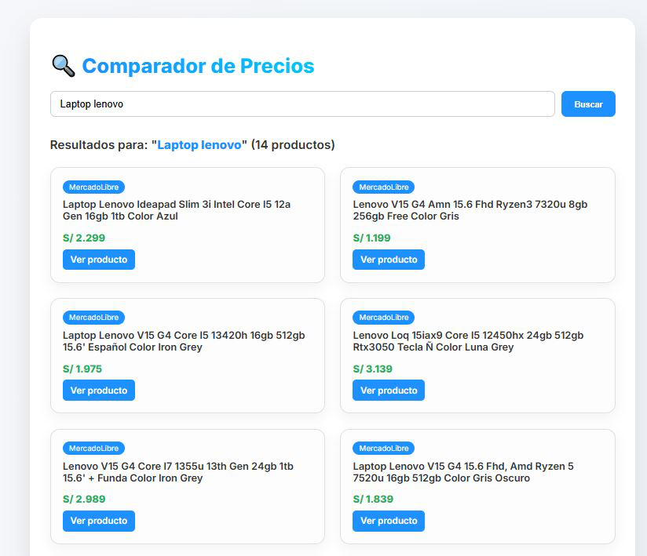

# 🔍 Comparador de Precios Online (Perú)

Una app web ligera que permite comparar precios de productos entre **Mercado Libre** y **Falabella Perú** con una interfaz moderna, animaciones y experiencia de usuario fluida.



---

## 🚀 Características

- 🛒 Scraping en tiempo real con `Selenium` y `BeautifulSoup`.
- 🔍 Interfaz intuitiva con buscador y loader animado.
- 🌐 Comparación de productos entre distintas tiendas.
- ⚙️ Estilo responsive y diseño tipo startup.
- 🔐 Headless scraping sin abrir el navegador visualmente.

---

## 📦 Tecnologías usadas

- `Python 3.10+`
- `Flask`
- `Selenium`
- `BeautifulSoup4`
- `HTML/CSS` (Frontend Vanilla)

---

## 📥 Instalación

1. Clona el repositorio:

```bash
git clone https://github.com/tuusuario/price-compare-app.git
cd price-compare-app
```

2. Instala las dependencias:

```bash
pip install -r requirements.txt
```

3. Asegúrate de tener `chromedriver.exe` en la raíz del proyecto.

4. Ejecuta la app:

```bash
python app.py
```

5. Abre en tu navegador: [http://localhost:5000](http://localhost:5000)

---

## 📌 Requisitos

- Python 3.10 o superior
- Google Chrome y `chromedriver` versión compatible
- Conexión a internet para scraping

---

## 🙌 Autor

**Benjamin Oscco Arias**  
[ben1998pe.github.io](https://ben1998pe.github.io)  
📬 ben.02.oscco@gmail.com